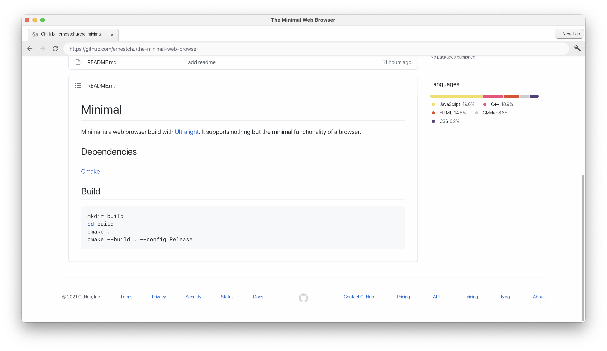

# Minimal
Minimal is a web browser build with [Ultralight](https://github.com/ultralight-ux/Ultralight). It supports nothing but the minimal functionality of a browser.


## Dependencies
[CMake](https://cmake.org)

## Build
```sh
mkdir build
cd build
cmake ..
cmake --build . --config Release
```

